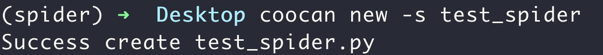

<div align="center">

# Coocan

**🚀 轻量级异步爬虫框架**

[](https://badge.fury.io/py/coocan)
[](https://pypi.org/project/coocan/)
[](https://opensource.org/licenses/MIT)

[安装](#-安装) •
[快速开始](#-快速开始) •
[功能特性](#-功能特性) •
[示例](#-示例) •
[文档](#-文档)


</div>

---

## 📖 简介

Coocan 是一个简洁、高效的 Python 异步爬虫框架，专为快速开发而设计。它基于 `httpx` 和 `asyncio`，提供了简单易用的 API，让你能够快速构建高性能的网络爬虫。

### ✨ 为什么选择 Coocan？

- **🪶 轻量级** - 核心代码简洁，依赖少，易于理解和扩展
- **⚡ 异步高效** - 基于 asyncio，充分利用异步 I/O 提升爬取效率
- **🎯 简单易用** - 类 Scrapy 的 API 设计，上手即用
- **🔧 功能完善** - 内置请求重试、优先级队列、代理支持、数据处理等功能
- **🎨 开箱即用** - 自带 XPath/CSS 选择器，随机 User-Agent，命令行工具等

---

## 📦 安装

### 使用 pip 安装

```bash
pip install -U coocan
```

### 要求

- Python >= 3.10

---

## 🚀 快速开始

### 1. 创建爬虫

使用命令行工具快速生成爬虫模板：

```bash
coocan new -s my_spider
```



### 2. 编写爬虫代码

```python
from coocan import MiniSpider, Request
from loguru import logger


class MySpider(MiniSpider):
    # 起始 URL 列表
    start_urls = ["https://example.com"]

    # 最大并发请求数
    max_concurrency = 10

    def parse(self, response):
        """解析响应"""
        # 使用 CSS 选择器提取数据
        titles = response.css('h1::text').getall()

        # 使用 XPath 提取数据
        links = response.xpath('//a/@href').getall()

        for title, link in zip(titles, links):
            logger.info(f"Title: {title}, Link: {link}")

            # 发起新请求
            yield Request(link, callback=self.parse_detail)

    def parse_detail(self, response):
        """解析详情页"""
        content = response.css('.content::text').get()
        logger.success(f"Content: {content}")


if __name__ == '__main__':
    spider = MySpider()
    spider.go()
```

### 3. 运行爬虫

```bash
# 直接运行
python my_spider.py

# 或使用 CLI 工具
coocan run my_spider.py
```

---

## 🎯 功能特性

### 核心功能

| 功能           | 说明                                    |
| -------------- | --------------------------------------- |
| **异步请求**   | 基于 httpx 的异步 HTTP 客户端           |
| **智能重试**   | 自动重试失败的请求                      |
| **优先级队列** | 支持请求优先级控制                      |
| **代理支持**   | 轻松配置 HTTP/HTTPS 代理                |
| **请求延迟**   | 支持固定延迟或随机延迟范围              |
| **随机 UA**    | 自动随机 User-Agent                     |
| **中间件**     | 支持请求预处理                          |
| **数据管道**   | `process_item` 方法处理爬取数据         |
| **异常处理**   | 完善的异常处理机制                      |
| **选择器**     | 内置 XPath 和 CSS 选择器                |
| **爬取统计**   | 自动统计请求成功/失败次数、耗时等       |
| **URL 去重**   | 可选的 URL 去重功能，避免重复请求       |
| **生命周期**   | `spider_opened` / `spider_closed` 钩子  |
| **优雅退出**   | 支持 Ctrl+C 优雅退出                    |
| **多 HTTP 方法** | 支持 GET/POST/PUT/DELETE/PATCH 等     |

### 类属性配置

```python
class MySpider(MiniSpider):
    start_urls = ["https://example.com"]   # 起始 URL
    max_concurrency = 10                   # 最大并发请求数（信号量限制）
    worker_count = None                    # 请求处理协程数，None 则自动为 max_concurrency * 2
    max_retry_times = 3                    # 最大重试次数
    delay = 0                              # 请求延迟（秒），支持元组如 (1, 3) 表示 1-3 秒随机延迟
    enable_random_ua = True                # 启用随机 User-Agent
    enable_duplicate_filter = False        # 启用 URL 去重
    item_speed = 10                        # 数据处理协程数
    client_limits = None                   # httpx.Limits，控制连接池（如最大连接数、keepalive）
```

---

## 📚 示例

### 示例 1：基础爬虫

```python
from coocan import MiniSpider
from loguru import logger


class BasicSpider(MiniSpider):
    start_urls = ["https://httpbin.org/get"]

    def parse(self, response):
        data = response.json()
        logger.info(f"Your IP: {data.get('origin')}")


if __name__ == '__main__':
    BasicSpider().go()
```

### 示例 2：使用代理

```python
from coocan import MiniSpider, Request


class ProxySpider(MiniSpider):
    def start_requests(self):
        yield Request(
            url="https://httpbin.org/ip",
            callback=self.parse,
            proxy="http://proxy.example.com:8080"
        )

    def parse(self, response):
        print(response.text)
```

更多示例请查看 [`coocan/_examples/`](coocan/_examples/) 目录：

- `crawl_csdn_list.py` - 爬取 CSDN 文章列表
- `crawl_csdn_detail.py` - 爬取 CSDN 文章详情
- `recv_item.py` - 数据处理示例
- `use_proxy.py` - 代理使用示例
- `view_local_ip.py` - 查看本机 IP

### 示例 3：完整的 CSDN 爬虫

```python
import json
from loguru import logger
from coocan import Request, MiniSpider


class CSDNSpider(MiniSpider):
    start_urls = ["http://www.csdn.net"]
    max_concurrency = 10

    def middleware(self, request: Request):
        """请求中间件"""
        request.headers["Referer"] = "http://www.csdn.net/"

    def parse(self, response):
        """解析首页"""
        api = "https://blog.csdn.net/community/home-api/v1/get-business-list"
        params = {
            "page": "1",
            "size": "20",
            "businessType": "lately",
            "noMore": "false",
            "username": "markadc"
        }
        yield Request(
            api,
            self.parse_page,
            params=params,
            cb_kwargs={"api": api, "params": params}
        )

    def parse_page(self, response, api, params):
        """解析列表页"""
        current_page = params["page"]
        data = json.loads(response.text)
        articles = data["data"]["list"]

        if not articles:
            logger.warning(f"没有第 {current_page} 页")
            return

        for article in articles:
            date = article["formatTime"]
            title = article["title"]
            url = article["url"]

            logger.info(f"{date} - {title}\n{url}")

            # 爬取详情页
            yield Request(url, self.parse_detail, cb_kwargs={"title": title})

        logger.info(f"第 {current_page} 页抓取成功")

        # 抓取下一页
        next_page = int(current_page) + 1
        params["page"] = str(next_page)
        yield Request(api, self.parse_page, params=params, cb_kwargs={"api": api, "params": params})

    def parse_detail(self, response, title):
        """解析详情页"""
        logger.success(f"{response.status_code} - 已访问 {title}")

    def process_item(self, item):
        """处理数据"""
        # 可以在这里保存到数据库或文件
        logger.debug(f"Processing: {item}")


if __name__ == '__main__':
    spider = CSDNSpider()
    spider.go()
```

---

## 📖 文档

### Request 对象

```python
Request(
    url: str,                    # 请求 URL
    callback=None,               # 回调函数
    method: str = None,          # 请求方法 (GET/POST/PUT/DELETE/PATCH)，默认自动推断
    params: dict = None,         # URL 参数
    data: dict = None,           # POST 表单数据
    json: dict = None,           # JSON 数据
    headers: dict = None,        # 请求头
    cookies: dict = None,        # Cookies
    proxy: str = None,           # 代理地址
    timeout: int = 6,            # 超时时间
    priority: float = None,      # 优先级（数字越小优先级越高）
    cb_kwargs: dict = None,      # 传递给回调函数的额外参数
)
```

### Response 对象

```python
response.text           # 响应文本
response.content        # 响应字节
response.json()         # 解析 JSON
response.status_code    # 状态码
response.headers        # 响应头
response.url            # 请求 URL

# 选择器方法
response.xpath(query)   # XPath 选择器
response.css(query)     # CSS 选择器
```

### MiniSpider 主要方法

| 方法                                      | 说明                                      |
| ----------------------------------------- | ----------------------------------------- |
| `start_requests()`                        | 生成初始请求（可选，默认使用 start_urls） |
| `parse(response)`                         | 默认回调函数，解析响应                    |
| `middleware(request)`                     | 请求中间件，可修改请求                    |
| `validator(response)`                     | 验证响应是否有效                          |
| `process_item(item)`                      | 处理爬取的数据项                          |
| `spider_opened()`                         | 爬虫启动时调用                            |
| `spider_closed()`                         | 爬虫结束时调用                            |
| `handle_request_exception(e, request)`    | 处理请求异常                              |
| `handle_callback_exception(e, req, resp)` | 处理回调函数异常                          |
| `go()`                                    | 启动爬虫                                  |

### 爬取统计

爬虫结束时会自动输出统计信息：

```
爬虫 MySpider 结束 | 请求: 10 | 成功: 9 | 失败: 1 | 重试: 2 | 数据: 15 | 耗时: 3.25s
```

你也可以在代码中访问统计信息：

```python
class MySpider(MiniSpider):
    def spider_closed(self):
        print(f"成功率: {self.stats.success_count / self.stats.request_count * 100:.1f}%")
        print(f"总耗时: {self.stats.elapsed:.2f} 秒")
```

### 生命周期钩子

```python
class MySpider(MiniSpider):
    def spider_opened(self):
        """爬虫启动时调用，可用于初始化资源"""
        self.db = connect_database()
        print("爬虫启动，数据库已连接")

    def spider_closed(self):
        """爬虫结束时调用，可用于清理资源"""
        self.db.close()
        print(f"爬虫结束，共爬取 {self.stats.item_count} 条数据")
```

### URL 去重

启用 URL 去重可以避免重复请求同一个 URL：

```python
class MySpider(MiniSpider):
    enable_duplicate_filter = True  # 启用 URL 去重

    def start_requests(self):
        # 即使 yield 多个相同 URL，也只会请求一次
        for _ in range(10):
            yield Request("https://example.com", callback=self.parse)
```

### 随机延迟

支持固定延迟或随机延迟范围：

```python
class MySpider(MiniSpider):
    delay = 2              # 固定延迟 2 秒
    # 或
    delay = (1, 3)         # 随机延迟 1-3 秒
```

### 异常处理

```python
from coocan import MiniSpider, Request
from coocan.spider.base import IgnoreRequest, IgnoreResponse
from loguru import logger


class MySpider(MiniSpider):
    def handle_request_exception(self, e: Exception, request: Request):
        """处理请求异常"""
        # 抛出 IgnoreRequest 表示放弃该请求
        raise IgnoreRequest("放弃请求")

        # 或返回新请求替代
        # return Request(new_url, callback=self.parse)

    def validator(self, response):
        """验证响应"""
        if response.status_code != 200:
            # 抛出 IgnoreResponse 跳过回调
            raise IgnoreResponse("状态码异常")

    def handle_callback_exception(self, e: Exception, request: Request, response):
        """处理回调异常"""
        logger.error(f"回调异常: {e}")
```

---

## 🛠️ 命令行工具

Coocan 提供了便捷的命令行工具：

```bash
# 创建新爬虫
coocan new -s spider_name

# 运行爬虫文件（自动发现 MiniSpider 子类）
coocan run my_spider.py

# 检查爬虫配置
coocan check my_spider.py

# 生成随机 User-Agent
coocan ua -n 5

# 查看版本
coocan --version

# 直接输入 coocan 也显示版本
coocan

# 查看帮助
coocan --help
```

---

## 📝 更新日志

### v0.9.1 (2026-5-7)

- ✨ **异步回调支持增强** - `parse` / 自定义 callback 支持 `async def`、异步生成器、直接返回 `dict` 或 `Request`
- 🐛 **默认回调兜底** - `Request(callback=None)` 入队后默认使用 `parse`，避免空回调导致运行期异常
- 🐛 **优雅退出修复** - Ctrl+C 会取消主任务并回收 worker，确保关闭 HTTP 客户端并执行 `spider_closed()`
- ⚡ **连接池隔离优化** - 全局 `httpx.AsyncClient` 按 `httpx.Limits` 分池缓存，避免不同爬虫配置互相影响
- ⚡ **URL 去重增强** - 请求指纹加入 `cookies` 和 `proxy`，并兼容不可 JSON 序列化的请求参数
- ✨ **CLI 静态识别增强** - 支持 `import coocan as cc` 后继承 `cc.MiniSpider` 的写法
- ✨ **异常导出完善** - `IgnoreResponse` 可直接从 `coocan` / `coocan.spider` 导入
- 🧪 **测试稳定性优化** - 默认测试改为离线可运行，减少对外网和第三方页面内容的依赖

### v0.9.0 (2026-5-6)

- 🐛 **CLI 安全加载** - `coocan run/check` 在导入执行前先静态检查 `MiniSpider` 子类，避免普通脚本被误执行
- 🐛 **检查命令退出码** - `coocan check` 发现配置错误或未找到爬虫类时返回非 0，便于 CI/脚本集成
- ✨ **爬虫配置校验增强** - 严格校验 `start_urls` 类型和元素内容，识别负数/布尔值等非法 `delay`
- ⚡ **CLI 校验输出复用** - `run` 和 `check` 共用同一套检查输出逻辑，错误提示更一致
- ⚡ **错误样式统一** - CLI 异常统一使用中文红色错误前缀，避免重复样式污染输出
- ✨ **类名生成优化** - `coocan new -s URL_spider` 会生成 `URLSpider`，保留已有大小写

### v0.8.1 (2025-4-24)

- ✨ **CLI 版本展示** - `coocan` 命令直接展示版本号「coocan version x.x.x」
- ✨ **`coocan --version`** - 支持 `--version` 参数查看版本

### v0.8.0 (2025-4-24)

- ⚡ **代理请求复用客户端** - 按 proxy 维度缓存 `httpx.AsyncClient`，爬虫结束时统一关闭，避免频繁创建/销毁连接
- ⚡ **并发控制修复** - 新增 `worker_count` 参数（默认 `max_concurrency * 2`），与信号量并发限制解耦
- ⚡ **`process_item` 支持异步** - 自动检测协程函数，同步/异步兼容，数据处理不再阻塞事件循环
- ⚡ **暴露连接池配置** - 新增 `client_limits` 参数，支持 `httpx.Limits` 调优

### v0.7.0 (2025-2-9)

- ✨ **爬取统计** - 自动统计请求成功/失败次数、重试次数、数据项数量、耗时
- ✨ **生命周期钩子** - 新增 `spider_opened()` 和 `spider_closed()` 方法
- ✨ **URL 去重** - 新增 `enable_duplicate_filter` 属性，可选启用 URL 去重
- ✨ **随机延迟** - `delay` 属性支持元组，如 `delay = (1, 3)` 表示 1-3 秒随机延迟
- ✨ **优雅退出** - 支持 Ctrl+C 优雅退出
- ✨ **更多 HTTP 方法** - Request 支持 `method` 参数，可使用 PUT/DELETE/PATCH 等方法
- ✨ **Cookies 支持** - Request 支持 `cookies` 参数
- 🐛 **修复资源泄露** - 修复 HTTP 客户端未正确关闭的问题
- 🐛 **修复响应验证** - 修复 `raise_has_text` 和 `raise_no_text` 在优化模式下失效的问题
- ⚡ **性能优化** - Selector 延迟初始化，只有使用 xpath/css 时才解析 HTML
- ⚡ **UA 更新** - 更新 User-Agent 浏览器版本到 Chrome 110-130

### v0.6.1 (2025-5-15)

- ✨ 请求支持代理，使用 `proxy` 参数
- ⚡ 请求的默认超时设置为 6 秒

### v0.5.0 (2025-4-28)

- ✨ 新增 `process_item` 方法，用于处理数据
  - 示例代码位于 `coocan/_examples/recv_item.py`

### v0.4.0 (2025-4-25)

- 🎉 实现 `coocan` 命令行工具
  - 支持 `coocan new -s <spider_file_name>` 创建爬虫

### v0.3.2 (2025-4-23)

- ✨ 可以设置请求延迟 (`delay` 属性)
- ✨ 默认启用随机 User-Agent (`enable_random_ua` 属性)

### v0.3.1 (2025-4-22)

- ✨ 请求支持优先级参数 (`priority`)

### v0.3.0 (2025-4-21)

- ✨ 请求异常时触发 `handle_request_exception`
  - 可抛出 `IgnoreRequest` 异常放弃请求
  - 可返回新的 `Request` 对象替代原请求
- ✨ 加入响应验证器 `validator`
  - 可抛出 `IgnoreResponse` 异常跳过回调
- ✨ 回调异常时触发 `handle_callback_exception`

### v0.2.0 (2025-4-18)

- ✨ 响应对象支持 `XPath` 和 `CSS` 选择器
- ✨ 加入请求重试机制
- ✨ 请求异常处理回调函数

---

## 🤝 贡献

欢迎提交 Issue 和 Pull Request！

1. Fork 本仓库
2. 创建你的特性分支 (`git checkout -b feature/AmazingFeature`)
3. 提交你的更改 (`git commit -m 'Add some AmazingFeature'`)
4. 推送到分支 (`git push origin feature/AmazingFeature`)
5. 开启一个 Pull Request

---

## 📄 许可证

本项目采用 [MIT](https://opensource.org/licenses/MIT) 许可证。

---

## 👨‍💻 作者

**wauo** - [markadc@126.com](mailto:markadc@126.com)

项目主页: [https://github.com/markadc/coocan](https://github.com/markadc/coocan)

---

<div align="center">

**如果这个项目对你有帮助，请给一个 ⭐️ Star 支持一下！**

</div>
